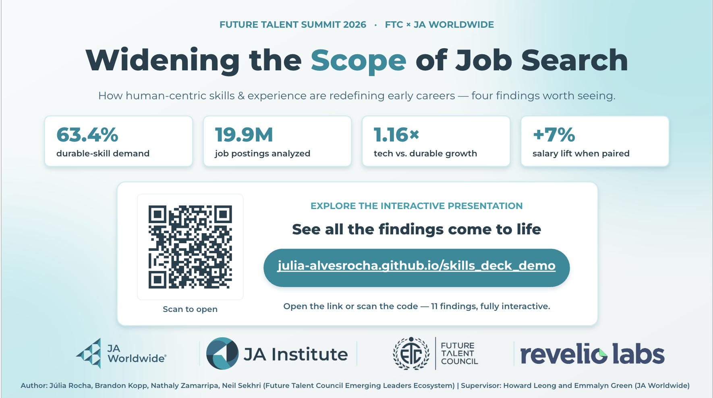

# Widening the Scope of Job Search

> **How human-centric skills and experience are redefining early careers.**

This repository contains the interactive presentation, visualizations, and supporting materials for **Widening the Scope of Job Search**, a white paper developed for the **Future Talent Summit 2026** in collaboration with **JA Worldwide**, **JA Institute**, **Future Talent Council**, and **Revelio Labs**.

The project explores how the entry-level labor market is evolving and challenges conventional narratives around skills, credentials, and employability.

  

---

## Overview

For years, conversations about the future of work have emphasized *technical skills*, *AI*, and *human skills*. While these discussions are valuable, they often overlook a more fundamental shift happening underneath the labor market.

This research asks a different question:

> **Is the growing emphasis on human skills masking a deeper structural problem—credential inflation and the displacement of experienced workers into entry-level roles?**

Using one of the largest labor market datasets available, this study examines how hiring expectations have changed and what that means for students, graduates, employers, educators, and policymakers.

Rather than focusing solely on credentials, the paper argues for a broader understanding of employability—one that recognizes **human-centric skills, practical experience, and opportunity pathways** as the true entry point into today's workforce.

---

## Dataset

The analysis combines large-scale labor market intelligence with original survey research.

### Labor Market Analysis

- **19.9 million** job postings
- **20 countries**
- **26 tracked skills**
- Multi-year hiring trend analysis
- Powered by **Revelio Labs**

### Student Survey

Additional findings are informed by survey responses from university students and recent graduates, providing qualitative insight into today's entry-level hiring experience.

Key perceptions include:

- **63%** believe entry-level jobs require unrealistic experience
- **69%** report a gap between university education and technical skills required by employers
- **68%** feel pressure to earn additional certifications
- **70%** believe the current entry-level job market is unfair

---

## Research Questions

The white paper explores questions including:

- How are hiring requirements changing?
- What is the relationship between technical and durable (human) skills?
- Are employers valuing human-centric capabilities more than technical specialization?
- Is credential inflation limiting access to entry-level careers?
- What barriers are students experiencing during the job search?
- How can organizations widen access to meaningful early-career opportunities?

---

## Key Findings

Among the findings presented in the interactive deck:

- Durable (human) skill demand continues to grow across industries.
- Nearly **20 million** job postings reveal measurable shifts in hiring expectations.
- Human skills increasingly complement—not replace—technical expertise.
- Pairing technical and durable skills is associated with measurable salary premiums.
- Experience requirements remain one of the largest barriers facing early-career talent.
- Networking, unclear expectations, and credential inflation significantly influence hiring outcomes.

---

## Interactive Presentation

Explore the complete interactive presentation:

**https://julia-alvesrocha.github.io/skills_deck_demo**

The presentation contains all findings, visualizations, methodology, and supporting analysis.

---

## Partners

This work was developed through collaboration between:

- JA Worldwide
- JA Institute
- Future Talent Council
- Revelio Labs

---

## Authors

- Júlia Rocha
- Brandon Kopp
- Nathaly Zamarripa
- Neil Sekhri

## Supervisors

- Howard Leong
- Emmalyn Green

---

## License

This repository is intended for research and educational purposes.

Data provided by Revelio Labs remains subject to its respective licensing and usage terms.
